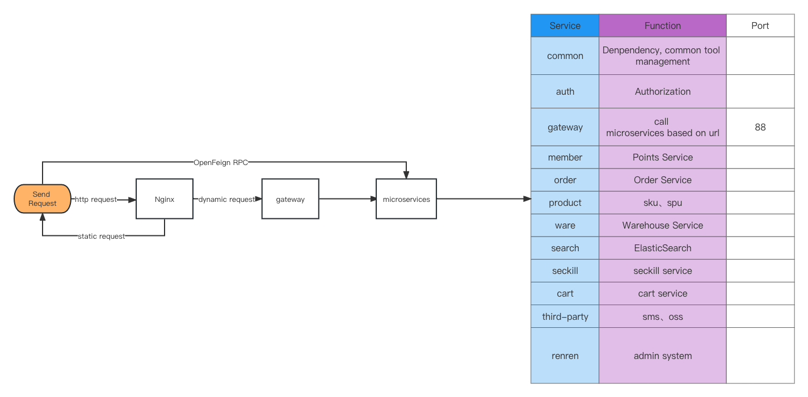

# Gumall — E-commerce Platform with Distributed Architecture

   [](https://www.apache.org/licenses/LICENSE-2.0.html)         

## Introduction
Gumall is an e-commerce platform that has been developed with a distributed architecture using Spring Boot and Spring Cloud. The platform uses Docker to manage multiple middleware and Nginx for dynamic and static separation of resources, reverse proxy, and load balancing.

The platform introduces a complete set of microservice governance solutions, which includes Nacos as a registration and configuration center, Gateway as a gateway, Feign for remote call, Ribbon for load balancing, Sentinel for flow protection, Sleuth, and Zipkin as a tracing system.

Gumall solves most of the problems faced by a highly concurrent distributed system by implementing Spring Cache and Redis as a distributed cache, Elasticsearch for faster product retrieval time, thread pool, and asynchronous task for stability and performance.

Gumall has implemented generating/cancelling order and locking/unlocking inventory using RabbitMQ delayed queue based on BASE theory and Flexible Transaction - message reliability and eventual consistency of transactions in a distributed system.

Furthermore, Gumall has completed product flash sale using Redisson distributed lock - Semaphore and MQ, which can process 50,000 QPS in one Tomcat server.


## Tech Stack

### Main Stack

| Services | Used Technologies                                     |
| -------- | -------- |
| Login | SMS, SSO single sign-on, social, interceptor with threadlocal, distributed session |
| Product Listing | Elasticsearch, Aliyun OSS |
| Seckill     | Timed tasks, Redis semaphore |
| Product search | Elasticsearch         |
| Cart         |  Redis        |
| Order        |  Mysql, Redis        |
| Warehouse    |  Mysql, Redis        |


### Other Services
| Tools | Used tools                                     |
| -------- | -------- |
| UserInteface | ES6, Vue.js, ElementUI |
| Cluster Deployment | Jenkins, Kubernetes |
| ELK | LogStash |
| Flow Control | Sentinel |
| Extended Certification and Authorisation | Spring Security |
| Visualisation | Prometheus and Grafana|
| Documents | swagger |


## How to run
To run Gumall, you need to have Docker installed on your system. Once Docker is installed, you can use the following command to run Gumall:

```
docker-compose up -d
```

### Admin system
This command will start all the required services for Gumall. Once the services are up and running, you can access the admin platform by visiting the following URL:
```
http://localhost:8001/#/login
```
## System Design
### Product Manage System (PMS)
Due to the specificity of the e-commerce product, we have quoted the design solution provided by Alibaba. The products are divided into SPUs and SKUs. for more details see:  <a herf="https://topic.alibabacloud.com/a/difference-between-product-and-commodity-sku-spu-whats-the-key-attribute-whats-the-product-attribute_8_8_10239646.html"> Difference between product and commodity SKU SPU </a> .Below is a detailed explanation of the concepts as well as the relationship between the two, as well as an explanation of the PMS design.

* **Sales Attribute**: The different attribute values of the sales attributes of a product will lead to differences in the sales price of this product. e.g. iPhone 12 Pro Max 256GB and iPhone 12 Pro Max 512GB have a different sales price. So "capacity" is a sales attribute
* **Regular Attribute**: It will not affect the price of the product, like the length, weight, ppi of iPhone 12 Pro Max.
* **SPU (Standard Product Unit)**: It is a type of goods, such as a type of iPhone, like iPhone 12 Pro Max.
* **SKU (Stock Keeping Unit)**: To save the smallest available unit of inventory control. It is a specific product unit based on the SPU, like iPhone 12 Pro Max Gold+256GB, iPhone 12 Pro Max Gold+512GB, iPhone 12 Pro Max Blue+256GB, iPhone 12 Pro Max Sliver+512GB. i.e. SKU is a combination of various Sales Attributes (color + capacity) of the SPU.


## Flowcharts
### Main flow chart


## Conclusion
Gumall is an e-commerce platform that has been developed with a distributed architecture to solve the problems faced by a highly concurrent distributed system. It uses various technologies such as Spring Boot, Spring Cloud, Docker, Nginx, Nacos, Gateway, Feign, Ribbon, Sentinel, Sleuth, Zipkin, Spring Cache, Redis, Elasticsearch, RabbitMQ, and Redisson to provide a reliable and performant platform.